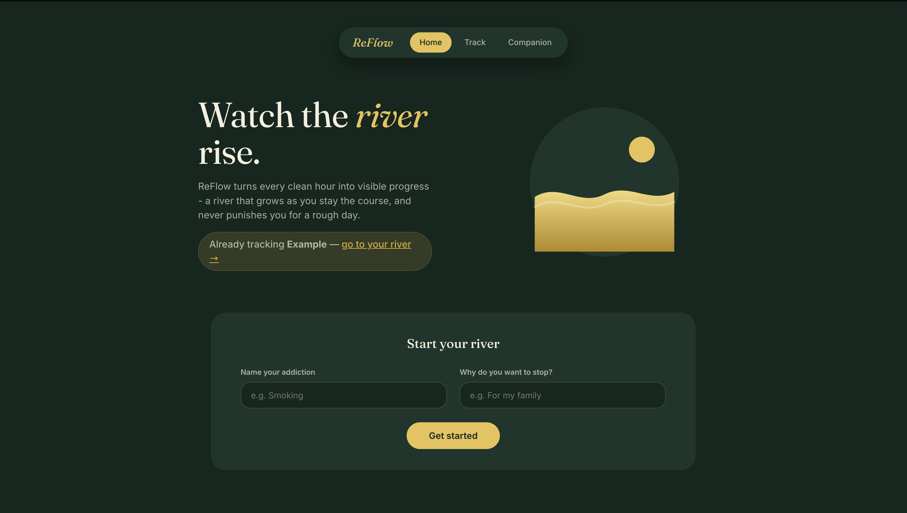
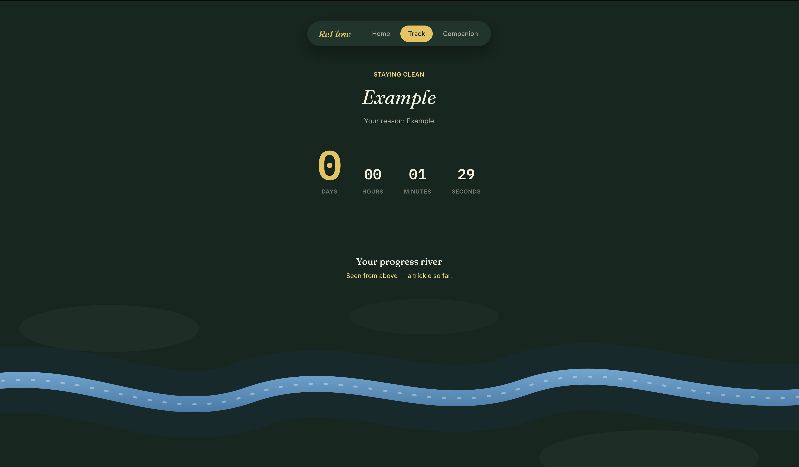
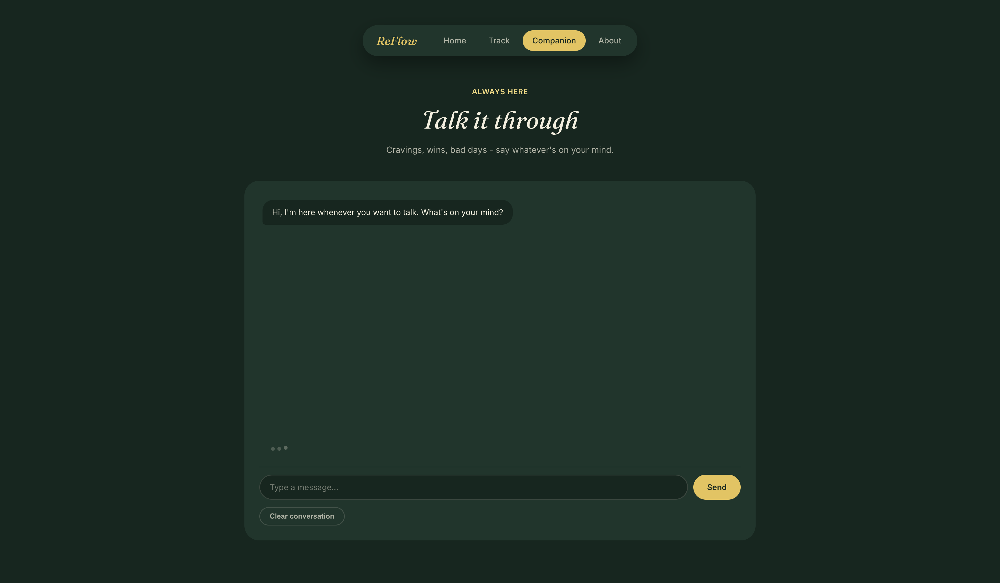
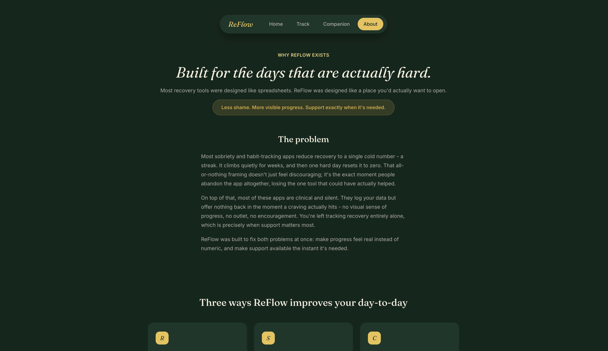

# ReFlow

A minimalist addiction recovery tracker that visualizes your progress as a living river. Stay clean, the river fills with water and life. Slip, it gently recedes without guilt or punishment.

## Features

- **Visual Progress River** – Watch your recovery come to life as an animated SVG river that grows with each clean day
- **AI Companion** – Talk to a supportive AI that listens without judgment, powered by DeepSeek API
- **Daily Check-in** – Track your mood and reflect on your progress
- **Onboarding Flow** – Name your addiction and set your reason for quitting
- **Privacy First** – All data stored locally in your browser via localStorage, no accounts needed
- **Simple input Sanitization** – Might protect against XSS attacks

## Pages

- **Home** – Landing page with onboarding and feature overview

- **Track** – Main dashboard with day counter, live timer, and the progress river

- **Companion** – AI chat interface for support and reflection

- **About** – Project mission and QoL improvements

## Tech Stack

- HTML5, CSS3, JavaScript
- SVG animations (river visualization)
- DeepSeek API (AI companion)
- Vercel (hosting + serverless functions)
- localStorage (data persistence)

## Live Demo

[https://re-flow-ashen.vercel.app](https://re-flow-ashen.vercel.app)

## How It Works

1. Name your addiction and your reason for quitting
2. Each day you stay clean, the river grows - water rises, plants appear, fish swim
3. If you slip, the river gently recedes - no punishment, no hard reset
4. Talk to the AI companion anytime you need support
5. Track your mood daily to understand your patterns

## Why I Built This

I know what addiction feels like. Most recovery tools are either too clinical or too punishing - they reset your progress when you slip. ReFlow is different. It shows you that one bad day doesn't erase your progress. The river can always flow again.

## License
MIT

## Author
Aeriss: https://github.com/aerissdev-dotcom